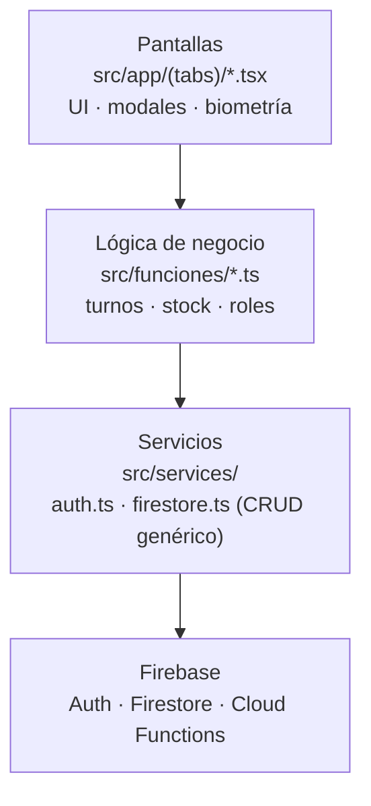
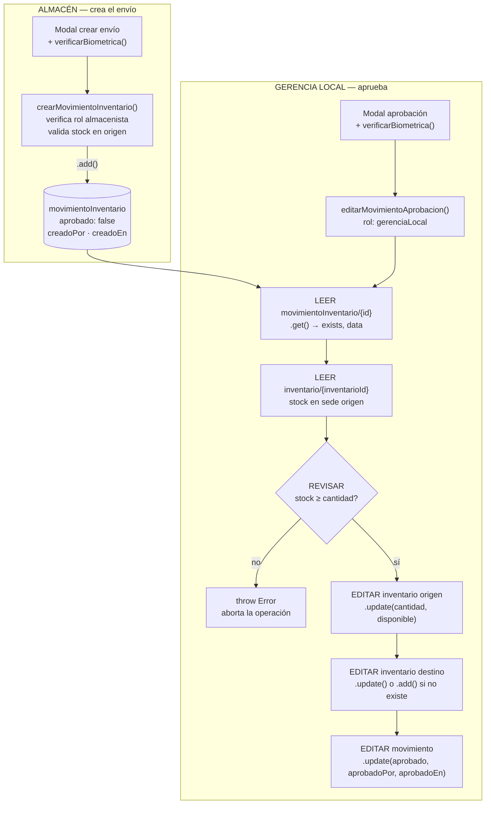
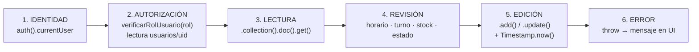

# Esbozo de exposición — Funcionamiento interno de TovarSatApp

> Documento generado a partir del código real del repositorio (rutas verificadas).
> Los bloques de código Mermaid se pueden pegar directamente en mermaid.live, la previsualización de VS Code o un add-in de PowerPoint.

## Recuento de lo que existe (contexto para el presentador)

| Componente | Ruta | Rol |
|---|---|---|
| **App móvil (activa)** | `BetaTest/` | App Android/iOS en Expo + React Native + TypeScript |
| App previa (referencia) | `TovarSatAlpha/` | Iteración anterior; base del patrón actual |
| Cloud Functions | `functions/src/index.ts` | `crearUsuario`, `editarUsuario`, `eliminarUsuario` (Node 24) |
| Web app | `web-app/` | Scaffold React + Vite + Firebase Data Connect (sin lógica propia aún) |
| Config raíz | `firebase.json`, `firestore.rules`, `firestore.indexes.json` | Reglas de seguridad e índices |

## Sección 1 — Funcionamiento general, tecnologías y uso

*(breve; enlaza con la presentación del proyecto)*

**Qué es:** aplicación móvil interna de TovarSat que digitaliza la operación diaria de sus sedes: control de **inventario multi-sede**, **envíos entre sedes con flujo de aprobación**, **registro de asistencia del personal** y **administración de usuarios**.

**Pila tecnológica y para qué se usa cada cosa:**

- **Expo + React Native + TypeScript** → una sola base de código para Android/iOS; navegación declarativa con **expo-router** (pestañas: Inicio, Asistencia, Envíos, Inventario, Registrar).
- **Firebase Authentication** → login de empleados por correo/contraseña; los usuarios se gestionan desde la app (solo Gerencia Local).
- **Cloud Firestore** → base de datos NoSQL documental: colecciones `usuarios`, `asistencias`, `inventario`, `movimientoInventario`, `sedes`, `modelos`, `diasExonerados`.
- **Cloud Functions** → operaciones privilegiadas del lado servidor (crear/editar/eliminar usuarios en Auth + Firestore).
- **expo-local-authentication** → huella/biometría del teléfono como segunda verificación de identidad en acciones sensibles.
- **xlsx + expo-file-system/sharing** → exportación de reportes (asistencias, inventario) a Excel.

> Guión sugerido: 1–2 diapositivas. «El teléfono del empleado es la interfaz; Firebase es el backend; la biometría es la firma.»

## Sección 2 — Interfuncionamiento de tecnologías y módulos

**Arquitectura en 4 capas (todas convergen en Firebase):**



**Patrones de interacción:**

1. **Los módulos que guardan datos interactúan con Firestore.** Cada módulo (`funcionesAsistencia`, `funcionesEnvios`, `funcionesInventario`, `funcionesExonerados`, `funcionesRegistro`) escribe/lee sus colecciones vía `@react-native-firebase/firestore` o el servicio genérico `services/firestore.ts` (`getColeccion`, `getDocumento`, `crearDocumento`, `actualizarDocumento`, `eliminarDocumento`, `getDonde`).

2. **Los módulos sensibles combinan biometría + verificación de rol**, en ese orden:
   - La **biometría** (`verificarBiometrica()` en `funcionesAsistencia.ts`, vía `expo-local-authentication`) la ejecuta el **componente** antes de abrir la operación — marca de asistencia, aprobar un envío, exonerar un día.
   - El **rol** lo verifica la **función de negocio** (`services/auth.ts → verificarRolUsuario(rol)`, que lee `usuarios/{uid}` y compara `rol` + `activo`). Ejemplo: Almacenista crea el envío, Gerencia Local lo aprueba.

3. **El login es Firebase Authentication + validación en Firestore** (`app/login.tsx`): `signInWithEmailAndPassword` → se lee `usuarios/{uid}` → si no existe o `activo === false`, se hace `signOut()` y se rechaza. Doble puerta: credencial válida ≠ usuario habilitado.

4. **Operaciones fuera del alcance del cliente van a Cloud Functions**: crear/eliminar usuarios exige privilegios de Admin SDK; la función valida `context.auth` y el rol `gerenciaLocal` **del lado del servidor** antes de tocar Auth.

> Nota honesta para preguntas: las reglas de `firestore.rules` están en modo de prueba (lectura/escritura abierta hasta 2026-07-20); el control real hoy se aplica en las funciones de negocio y en las Cloud Functions. *(Punto de mejora declarable.)*

## Sección 3 — Proceso básico: editar, revisar y leer un dato en Firestore (función real)

**Ejemplo elegido: `editarMovimientoAprobacion()`** — `BetaTest/src/funciones/funcionesEnvios.ts` (líneas 102–198). En **una sola función** hace las tres cosas: **lee** (2 documentos), **revisa** (rol, existencia, stock) y **edita** (2 colecciones); además es el corazón del flujo de negocio de envíos.

**Recorrido narrativo:**

1. **Identidad** — `auth().currentUser`: la sesión viene de Firebase Auth; sin usuario, se aborta.
2. **Autorización (revisar)** — `verificarRolUsuario('gerenciaLocal')`: lee `usuarios/{uid}` y compara el rol.
3. **Lectura del dato** — `.collection('movimientoInventario').doc(id).get()` → snapshot con `.exists` y `.data()`.
4. **Revisión de negocio** — se relee `inventario/{inventarioId}` y se valida: existe, y `cantidad - movimiento.cantidad ≥ 0`.
5. **Edición** — `.update()` sobre los documentos leídos: descuenta stock en origen, suma (o crea) en destino, y cierra el movimiento con `aprobado`, `aprobadoPor`, `aprobadoEn`.

**Código real (recortado para la diapositiva):**

```ts
export async function editarMovimientoAprobacion(
  movimientoId: string, aprobado: boolean): Promise<void> {
  const usuario = auth().currentUser
  if (!usuario) throw Error("Usuario No Autenticado")

  // REVISAR: rol GerenciaLocal (lectura de usuarios/{uid})
  const esGerenciaLocal = await serviceAuth.verificarRolUsuario('gerenciaLocal')
  if (!esGerenciaLocal) throw Error("Permisos insuficientes")

  // LEER: el movimiento a procesar
  const movimientoDoc = await firestore()
    .collection('movimientoInventario').doc(movimientoId).get()
  if (!movimientoDoc.exists) throw Error("Movimiento no encontrado")
  const movimiento = movimientoDoc.data() as DatosMovimiento

  if (aprobado) {
    // LEER: inventario de la sede origen
    const invOrigenRef = await firestore()
      .collection('inventario').doc(movimiento.inventarioId).get()
    const invOrigen = invOrigenRef.data()!
    const nuevaCantidadOrigen = invOrigen.cantidad - movimiento.cantidad
    if (nuevaCantidadOrigen < 0) throw Error("Stock insuficiente en la sede de origen")

    // EDITAR: descontar en origen … sumar en destino … cerrar el movimiento
    await firestore().collection('inventario')
      .doc(movimiento.inventarioId)
      .update({ cantidad: nuevaCantidadOrigen, disponible: nuevaCantidadOrigen > 0 })

    await firestore().collection('movimientoInventario')
      .doc(movimientoId)
      .update({ aprobado, aprobadoPor: usuario.uid, aprobadoEn: firestore.Timestamp.now() })
  }
}
```

**Diagrama del flujo completo de envíos:**



**Patrón universal (repetido en todo el código):**



**Otros ejemplos de reserva (mismo patrón):**

- **Lectura pura con enriquecimiento:** `obtenerMovimientos()` (`funcionesEnvios.ts`) — `getColeccion()` + `getDocumento()` por cada referencia para traducir IDs a nombres legibles.
- **Lectura según rol:** `verAsistencias()` (`funcionesAsistencia.ts`) — Gerencia Local consulta `usuarios` por sede y `asistencias` con `where('uid', 'in', grupo)` en lotes de 10 (límite de Firestore); un usuario normal solo consulta las suyas.
- **Creación con validación previa:** `crearAsistencia()` — ventana laboral 8:00–17:00, turno por corte a las 11:50, anti-duplicado por turno/día y cálculo de salida prevista.

**Demo sugerida (30–60 s):** iniciar sesión → marcar asistencia (se ve el prompt biométrico y el documento aparecer) → aprobar un envío como Gerencia Local → consola de Firebase en paralelo para mostrar la sincronización en tiempo real.

**Puntos fuertes / mejoras declarables (por si salen en preguntas):**

- ✅ Separación clara de capas: UI → funciones → servicios → Firebase; comentarios en español documentan el razonamiento.
- ✅ Doble factor en acciones sensibles (biometría en el dispositivo + rol en Firestore).
- ⚠️ Mejora declarable: las escrituras múltiples (descuento + suma + aprobación) se hacen como operaciones independientes desde el cliente; el siguiente paso natural sería `runTransaction`/`batch` del SDK y reglas de seguridad reales en `firestore.rules` (hoy en modo de prueba, expira 2026-07-20), moviendo la autorización de la capa JS a la capa de base de datos.
